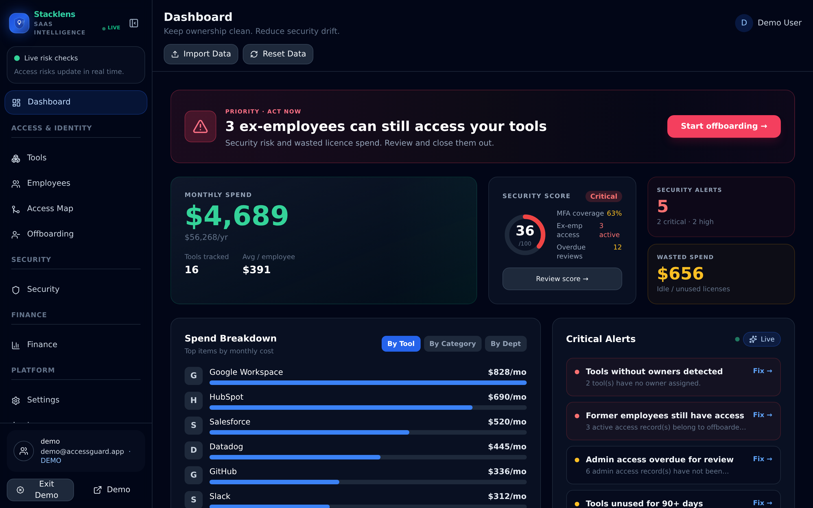
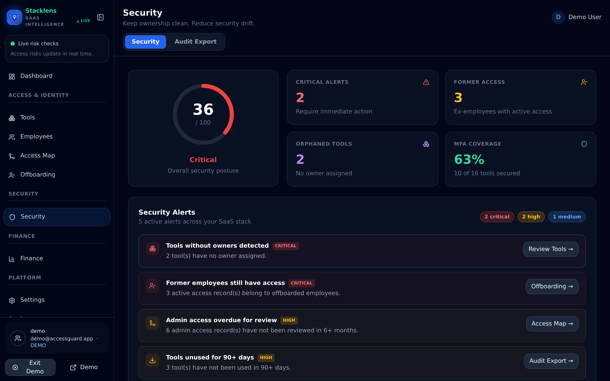
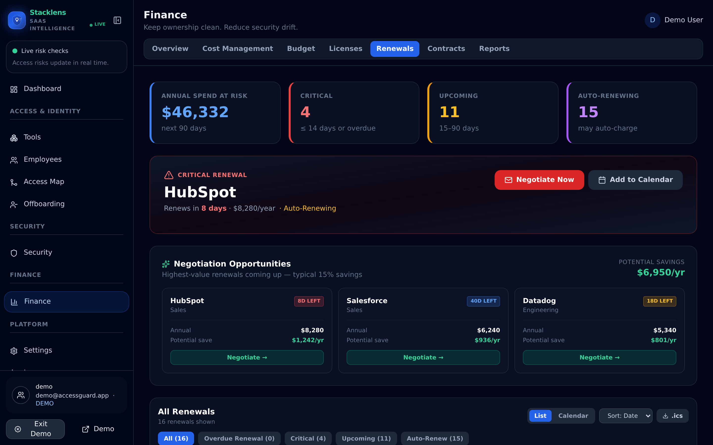
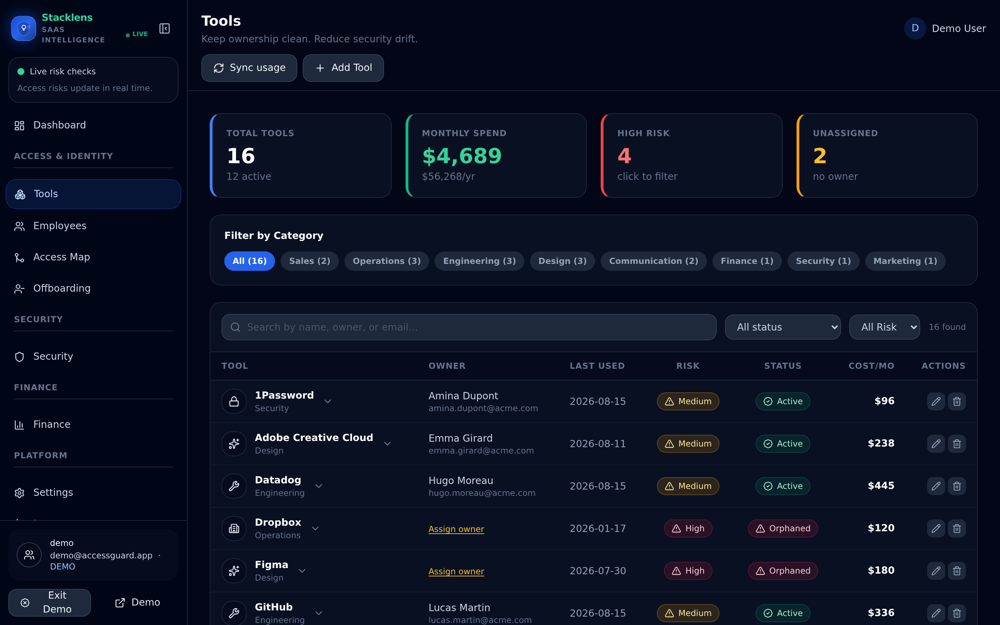
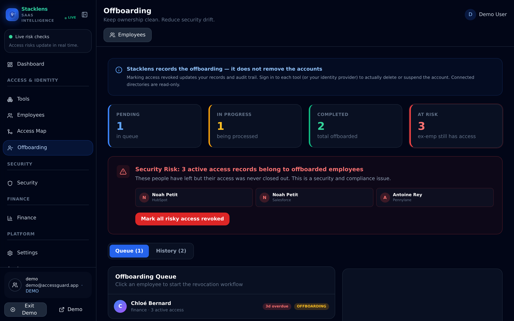
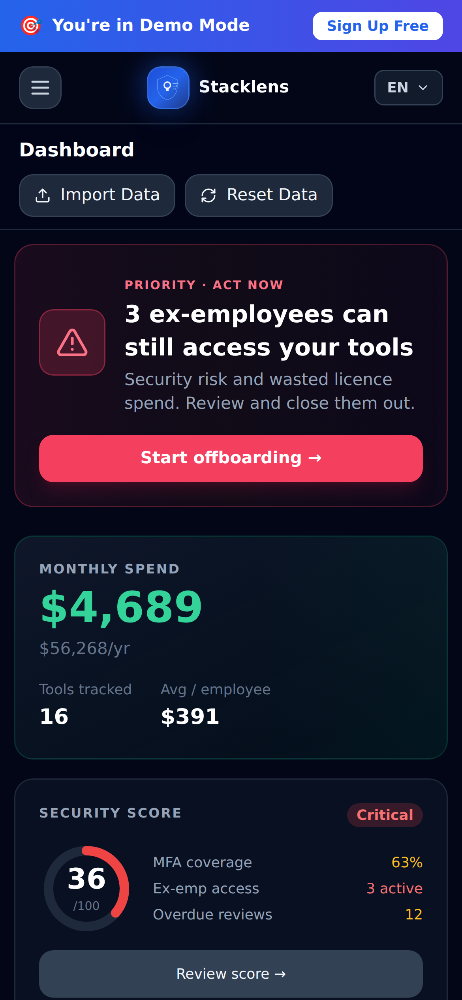

# Stacklens

SaaS spend and access management for small and mid-sized companies. Track every
tool, who can reach it, what it costs, and when it renews — then close the gaps
before an auditor or an invoice finds them.

Production: **https://stacklens.fr**

---

## What it does

| Module | Purpose |
|---|---|
| **Dashboard** | Monthly spend, security score, and an action inbox sorted by severity |
| **Tools** | The SaaS inventory — cost, owner, criticality, last used, renewal date |
| **Employees** | Directory with per-person app and cost breakdown |
| **Access Map** | Who has access to what, at what level, and how stale the review is |
| **Offboarding** | Queue of leavers, their live access, and a completion checklist |
| **Security** | Alerts for orphaned tools, ex-employee access, overdue admin reviews |
| **Finance** | Spend by tool/category/department, budgets, licences, renewals, contracts |
| **Audit** | A printable posture report and CSV exports for tools, employees and access |
| **Settings** | Team, billing, integrations, API keys, data export and deletion |

Data enters by CSV import (a 4-step wizard with per-row validation) or by
directory sync from Google Workspace, Microsoft 365, Slack, Okta, Zoom, Asana,
GitHub or Salesforce.



---

## Running it

```bash
npm ci
cp .env.example .env     # fill in the values — see "Services" below
npm run dev              # http://localhost:5173
```

Click **Try the live demo** on the landing page to explore with seeded data;
no account or backend needed.

### Everyday commands

```bash
npm run dev          # Vite dev server, port 5173
npm run build        # production build to dist/
npm run lint         # ESLint — must stay at 0 errors
npm test             # unit suite (fast, offline)
npm run test:rules   # Firestore security rules against the emulator (needs JDK 21+)
npm run test:all     # both suites
```

A husky pre-commit hook lints staged files, so a lint error blocks the commit.

---

## Architecture

React 18 + Vite SPA. No server of its own — Firebase provides auth, storage and
the handful of server-side functions.

### Data flow, and the one thing to understand first

Persistence is **localStorage-first**:

1. `localStorage` under `accessguard_v1` is the *read* path. All app state —
   tools, employees, access, contracts, invoices, licences — is one JSON blob.
2. Firestore `/userdata/{uid}` is a **debounced cloud backup**, written 1.5s
   after the last change. Large arrays (employees, access, audit_log) exceed
   Firestore's 1 MB document limit, so they are stored as size-capped slices in
   a `chunks` subcollection and reassembled on load.
3. On sign-in, `hydrateFromFirestore()` pulls cloud → local, with local winning
   if it holds more data.

The practical consequence: **never write to localStorage directly.** Mutate
through `useDbMutations()`, which calls `saveDb()` and schedules the cloud
write with failure reporting attached. A failed backup surfaces in the sync
banner with a retry, rather than being silently swallowed.

Billing state is deliberately **not** in that blob. It lives in `/users/{uid}`
and is written only by the Stripe webhook, because a client must never be able
to grant itself a plan.

### Layout

```
src/
  pages/            one file per route; finance/ and settings/ hold their tabs
  components/       AppShell, gates, shared UI primitives, import wizard
  lib/              pure logic — plan, db, dataUtils, currency, m365-writeback
  hooks/            useAuth, useDbQuery
  contexts/         language, currency, product tour
  firebase-config.js  auth, Firestore CRUD, Stripe calls, AI proxy
  translations.js   EN/FR/DE/ES/PT + useTranslation()
functions/index.js  all Cloud Functions (gen2, us-central1)
firestore.rules     the multi-tenant boundary — see Security
```

### Access control

Three independent gates, all in `components/gates.jsx`:

- `PlanGate` — plan hierarchy: `free → trial → starter → hr_finance → pro → enterprise → scale`
- `ModuleGate` — plan to module: `security`, `finance`, `people`
- `RoleGate` — role within a workspace: `viewer`, `editor`, `admin`, `owner`

`resolvePlan()` in `lib/plan.js` is the single source of truth. Always call it;
never read `db.user.plan` directly — it handles trial expiry and the founder
override.

---

## Security

Read this section before changing `firestore.rules` or `functions/index.js`.

**The rules are the entire multi-tenant boundary.** Everything separating one
customer's employee directory from another's is in that one file. It is covered
by 40 tests (`npm run test:rules`) which run in CI, and those tests have been
verified to fail against deliberately broken rules — they are not decorative.

- `/userdata/{uid}` and its `chunks` subcollection — owner only. Rules do not
  cascade to subcollections, so the grant is repeated deliberately.
- `/users/{uid}` — owner may read and edit profile fields; `plan`,
  `stripe_*`, `is_founder` and `role` are blocked from the client. A user may
  self-start a trial once; the stamp is immutable afterwards to defeat replay.
- `/integration_credentials/{uid}` — server-only. Even the owner cannot read
  back a stored vendor secret.
- Everything else — default deny.

**Cloud Functions** each verify a Firebase ID token, or are deliberately
unauthenticated with their own control (Stripe signature, SHA-256-hashed API
key, inbound-mail secret token, a 60/minute cap on crash reports). Per-user
rate limits live in `/rate_limits`.

### Known gaps — please keep this list honest

- **App Check is disabled** (`firebase-config.js`, `APP_CHECK_ENABLED = false`)
  after a broken token exchange. A valid Firebase ID token is currently the
  only gate on Functions.
- **Five of six integration credentials are still in the browser** — Slack,
  GitHub, Okta, Asana tokens and the Salesforce refresh token. Zoom has been
  migrated to `/integration_credentials` and is the pattern to follow.
- **No third-party assessment.** No pen test, no SOC 2, no secrets-in-history
  scan has been commissioned.
- Cloud Functions run in `us-central1`. Marketing says "EU data storage"; that
  is accurate for Firestore but processing is US, which a European DPO will ask
  about.

---

## Services it depends on

| Service | Used for | Where the secret lives |
|---|---|---|
| Firebase (project `accessguard-v2`) | Auth, Firestore, Hosting, Functions | `VITE_FIREBASE_*` — public by design |
| Stripe | Subscriptions and the billing portal | `STRIPE_SECRET_KEY`, `STRIPE_WEBHOOK_SECRET` in GCP Secret Manager |
| SendGrid | Invites, alerts, digests — sent from `hello@stacklens.fr` | `SENDGRID_API_KEY` in Secret Manager |
| Anthropic | AI assistant and auto-translation | `ANTHROPIC_API_KEY` in Secret Manager |
| Azure AD | Microsoft 365 sign-in and directory sync | `VITE_AZURE_CLIENT_ID` (public); multi-tenant app registration |
| Google Cloud | Workspace directory + token-activity audit | `VITE_GOOGLE_CLIENT_ID` (public) |
| OVH | `stacklens.fr` domain and mail redirects | account credentials |

Everything prefixed `VITE_` is bundled into the client and visible in the
browser. That is expected — those are publishable identifiers, not secrets.
Real secrets are only ever in GCP Secret Manager and read by Cloud Functions.

---

## Deploying

`main` is the deploy branch. Merging to it runs the workflow, which lints,
runs both test suites, builds, and deploys hosting.

```bash
firebase deploy --only hosting          # site
firebase deploy --only firestore        # rules and indexes
firebase deploy --only functions        # requires billing enabled on the GCP project
```

Two things that will bite you:

- **The CSP in `firebase.json` is strict.** Any new external API must be added
  to `connect-src` or the browser will block it in production while it works
  perfectly in dev. This failure mode is invisible locally.
- Source maps are off in production (`vite.config.js`).

---

## Working on it

- Match the surrounding code. It is plain JavaScript with JSX, Tailwind classes
  inline, and no TypeScript.
- **One name, one module.** `src/lib/no-duplicate-exports.test.js` fails the
  build if an exported name is defined in two files under `src/lib`. Three
  separate production bugs came from duplicated helpers that drifted apart —
  a broken CSV export, contradictory security metrics, and the wrong currency
  for Spanish users. Re-export instead: `export { x } from './owner'`.
- **Never hardcode user-facing text.** Add a key to all five dictionaries in
  `translations.js` and use `t('key')`. Missing keys fall back to English.
- Shared metrics (`computeSecurityScore`, `computeMfaCoverage`,
  `countOrphanedTools`, `countFormerEmployeeAccess`) live in `lib/dataUtils.js`
  precisely so two screens can never disagree about the same number. Use them.

---

## Screens

| | |
|---|---|
|  |  |
| Security posture and alerts | Renewal queue and negotiation opportunities |
|  |  |
| SaaS inventory | Offboarding queue |



---

## Status

Early access. The product works end to end and the codebase is covered by 147
unit tests plus 40 security-rules tests in CI, but there is no paying customer
yet, and directory sync for Google Workspace is pending Google's OAuth
verification (Restricted scopes, which require a CASA assessment).

The largest functional gap is that most integrations **read only**. Marking
access revoked updates Stacklens's records and audit trail; it does not delete
the account at the vendor. Microsoft 365 sign-in blocking is the first
exception. The UI says so plainly rather than implying otherwise.
